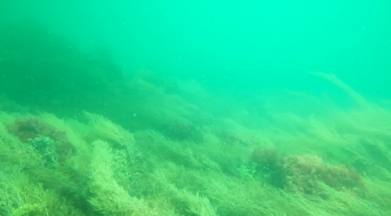
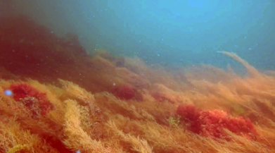
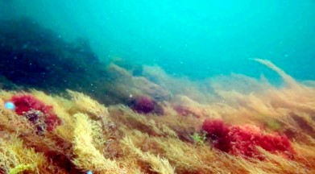

icon:material/image-sync
# Traitement des vidéos issues du système KOSMOS 


Le but de cet algorithme est d'améliorer les vidéos sous-marines en traitant la turbidité et en corrigeant les couleurs (en python) 

## I/ Prérequis 

Python : 
  Librairies: 
    - OpenCV
    - Numpy
    - Math
    - moviepy
    - Pathlib
    - Imageio 
    - OS
    - multiprocessing & concurrent.futures
    
 Pour installer les librairies, tapez dans la console spyder : pip install *nom de la librairie*
 
## II/ Lancer l'algorithme 

L'arborescence de fichier doit se présenter comme celui-ci : 


Avec les vidéos à traiter dans le dossier "Videos" et les vidéos traitées dans le dossier "Videos traitées". Le dossier "Frames" contiendra toutes les images
des videos et ces images seront traitées directement dans ce dossier. ⚠️ Pensez à vérifier que les chemins des différents dossiers, présents dans le code, sont exacts.

- Processing.py : contient le code qui va traiter une vidéo/image avec les méthodes d’égalisation d’histogramme, de débrumage et le rétinex.

Dans le fichier python il y a une partie pour modifier certains paramètres (ligne 335): 

``` 
### PARAMETRES A RENSEIGNER ### 
filename_video = './Vidéos/kosmos_2022-07-19-19-09-16.mp4'

db_min = 13
db_s =44

fin_min = 13
fin_s= 54

method = "HE"

filename_video_a_traiter = "./Vidéos/video.mp4"
###############################
```
C'est ici que l'on rentre la durée (db_min, db_s, fin_min, fin_s) de la vidéo que l'on souhaite traiter avec un temps de début et de fin. 
Il est également possible de ne traiter qu'une frame en définissant fin_min et fin_s à 0. 

La variable "method" va indiquer quelle méthode de traitement on souhaite utiliser, il est possible de rentrer soit "HE" ou  "retinex" ou "UDCP".

## III/ Exemples d'une image traitée avec les deux méthodes

Image originale: 

 


Image traitée avec HE et le débrumage : 

 


Image traitée avec le rétinex : 

 


## Sources : Algorithmes/articles utilisés :
- Single Image Haze Removal Using Dark Channel Prior, Kaiming He, Jian Sun, and Xiaoou Tang", in CVPR 2009 
- Guided Image Filtering, Kaiming He, Jian Sun, and Xiaoou Tang", in ECCV 2010.
- Properties and Performance of a Center/Surround Retinex, Daniel J. Jobson, Zia-ur Rahman, 1997 
- A Retinex-Based Enhancing Approach for Single Underwater Image, Xueyang Fu, Peixian Zhuang, Yue Huang, Yinghao Liao, Xiao-Ping Zhang, Xinghao Ding, 2014 


## Auteur 

***Zoë DAHERON*** - *stage technique* - IFREMER


Permission is hereby granted, free of charge, to any person obtaining a copy of this software and associated documentation files (the "Software"), to deal in the Software without restriction, including without limitation the rights to use, copy, modify, merge, publish, distribute, sub license, and/or sell copies of the Software, and to permit persons to whom the Software is furnished to do so.

THE SOFTWARE IS PROVIDED "AS IS", WITHOUT WARRANTY OF ANY KIND, EXPRESS OR IMPLIED, INCLUDING BUT NOT LIMITED TO THE WARRANTIES OF MERCHANTABILITY, FITNESS FOR A PARTICULAR PURPOSE AND NON INFRINGEMENT. IN NO EVENT SHALL THE AUTHORS OR COPYRIGHT HOLDERS BE LIABLE FOR ANY CLAIM, DAMAGES OR OTHER LIABILITY, WHETHER IN AN ACTION OF CONTRACT, TORT OR OTHERWISE, ARISING FROM, OUT OF OR IN CONNECTION WITH THE SOFTWARE OR THE USE OR OTHER DEALINGS IN THE SOFTWARE.

