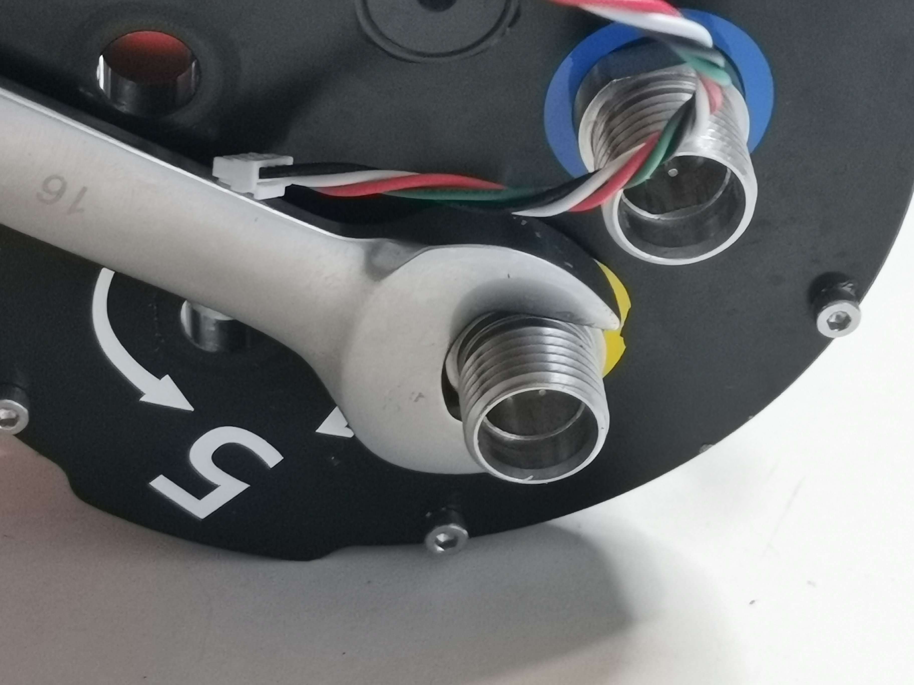
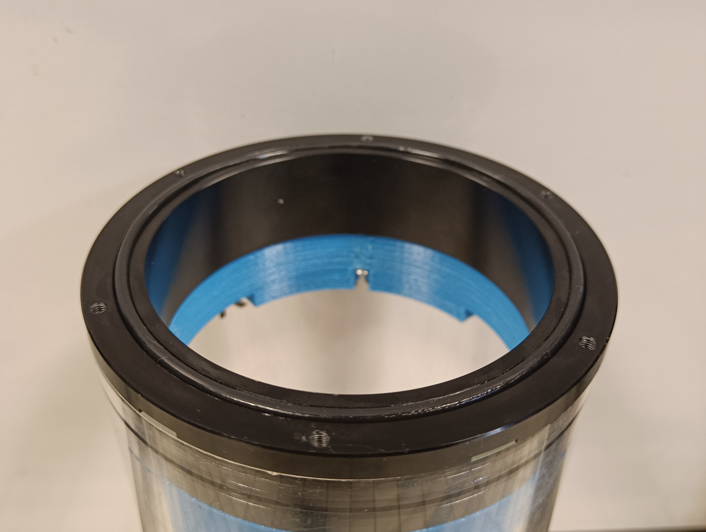

icon:material/waves
# Déploiement de Kosmos

## 1- Démarage

## 2- Remise en route
Cette partie explique les étapes de remise en route du système KOSMOS après un temps d'unitilisation.

### 2.1- Mise à jour du software
### Vérification de l'OS
- Vérifier la version de l'OS sur la carte SD de la Raspeberry Pi.
La dernière version de l'OS est Debian 12, (si la version est différente de la dernière version, réinstaller l'OS)
- Taper dans un terminal
```
cat /ect/os-release
```

### Vérification du programme
- Vérifier ensuite que le code est à jour
Toujours dans le terminal, vérifier que vous êtes bien sur la branche `dev_stereo` et récupérer la dernière version du code
```
git checkout dev_stereo //Vérifier la branche sur laquelle on se trouve
git pull //Récupérer la dernière version du code
```
- Vérifier que les dossiers CSV et Vidéo de la clé USB sont bien vides pour ne pas avoir de porblème de stockage

### 2.2- Vérification de la partie hardware
### Vérification des engrenages moteur
- Ouvrer le caisson des engrenages du moteur
- Faire tourner les engrenages manuellement pour s'assurer que rien ne bloque

### Mise au point de la caméra

???+ Note

        Pour être optimal, les réglages doivent s'effectuer dans une atmosphère lumineuse

- La première étape consiste à oter le filtre IR présent sur le capteur de la picam afin de maximiser le nombre de photons incidents. Pour cela on peut suivre le [guide](https://www.raspberrypi.com/documentation/accessories/camera.html#filter-removal) proposé par Raspberry.
- Cette étape réalisée, on nettoiera toutes les surfaces avec un chiffon microfibre puis on remontera l'objectif Edmund sur le capteur. Ré-assembler enfin ce module optique sur le système.
- Pour faire la mise au point de la caméra, le système ne sera pas placé dans le caisson. On branchera par ailleurs un écran à la Raspberry pour visualiser ce que filme la caméra.
- Une fois l'écran branché, on allumera le système et on attendra que le système KOSMOS soit en STAND BY.
- Dans l'interface WEB, modifier le paramètre `05_SYSTEM_shutdown` pour le mettre à 0 et effectuer un `Reboot`. Aller ensuite dans l'onglet `Camera` et éteindre arrêter le système KOSMOS en appuyant sur `Shutdown`. (Cette manipulation permet d'arrêter le script KOSMOS sans éteindre la Rpi. La caméra peut ainsi être utilisée.)
- Dans le terminal, taper ```rpicam-hello --timeout 0 ``` Cette instruction permet d'afficher le preview. Pour le quitter il suffira de taper ```Ctrl + C ```
- Placer une mire à cinq mètres de l'objectif. Ouvrir à fond l'objectif (le petit point blanc devant 1.8) pour avoir une profondeur de champ minimale. Réaliser le focus sur la mire avec la bague puis la bloquer solidement. Fermer enfin l'objectif à fond (le petit point blanc sur 11) pour récupérer une profondeur de champ maximale. Bloquer la bague d'ouverture dans cette position. Vérifier que le focus est toujours bon (le fait de serrer les bagues peut parfois les faire bouger.)
- Sortir du preview puis redémarrer la Raspberry Pi. Le soft kosmos va se remettre en route. Dans l'interface web, remettre le paramètre  `05_SYSTEM_shutdown` sur 1. Effectuer un `Reboot` puis éteindre le système avec un `Shutdown`.

### Lubrification des joints

???+ Warning

        Cette étape est indispensable et est à réaliser avec soin, elle assure l'étanchéité du système

- Déviser les connecteurs des caps  
  { width="300"}
- Vérifier qu'il n'y ait pas de cheveux sur vos joints  
- Graisser chaque joint (la couche de graisse doit être fine et homogène)  
  { width="300"}
- Reviser les connecteurs sans oublier les joints  
  { width="300"}
- Serrer pour assurer l'étanchéité  
  { width="300"}
  { width="300"}

- Déviser les caps des extrémitées (hublot transparent, et caps noir)
- Répéter les opérations ci dessus  
  { width="300"}

- Enlever les joints autour des "entretoises"
- Répéter les opérations ci dessus  
  { width="300"}

### Encapsulation
- Fermer le caisson de kosmos  
   

### Vérification du fonctionnement géneral de Kosmos
- Démarrer la caméra
- Connectez vous à l'interface web (10.42.0.1)
- Vérifier les paramètres dans l'onglet config:
   - 00_system_mode :
   - 01_system_record_button_gpio :
   - 02_system_stop_button_gpio :
   - 03_system_led_b :
   - 04_system_led_r :
   - 05_system_shutdown :
   - 06_system_moteur :
   - 10_motor_esc_gpio :
   - 11_motor_power_gpio :
   - 12_motor_button_gpio :
   - 13_motor_vitesse_min : 
   - 14_motor_vitesse_favorite : 
   - 15_motor_pause_time : 
   - 20_csv_step_time : 
   - 21_csc_file_name : 
   - 30_picam_file_name : 
   - 31_picam_resolution_x : 
   - 32_picam_resolution_y : 
   - 33_picam_preview :
   - 34_picam_framérate : 
   - 35_picam_record_time :
   - 36_picam_conversion_mp4 :
   - 37_picam_awb :
     
- Vérifier avec le live que la caméra est positionnée de façon à ce que l'image soit droite
- Démarer une vidéo
- Observer si le moteur tourne correctement
- Arreter la video et vérifier que l'enregistrement c'est bien passé (création d'un fichier cvs et conversion du fichier vidéo h264 en mp4)


  
